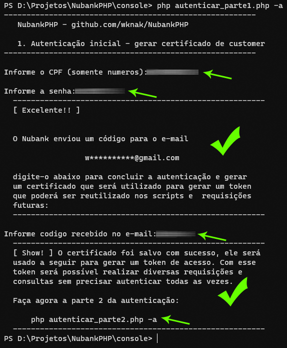
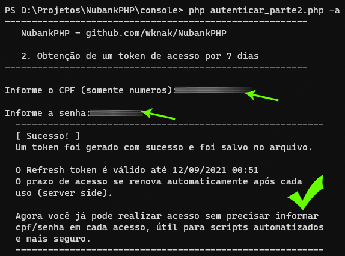

# NubankPHP
Biblioteca não oficial para acesso a dados de sua conta NuBank.

* Utilize com resposabilidade e segurança. 
* **Não exponha seus dados em ambientes não controlados.**
* A qualquer momento o Nubank poderá mudar dados e protocolos e poderá "quebrar" sua aplicação.
* O Autor não se responsabiliza pela má utilização, por perdas ou prejuízos.
* Contribuia para o projeto :-)

## Em desenvolvimento

Projeto inicial em desenvolvimento.

## TODO
- [ ] Colocar access-token em cache por algumas horas (minimizar reautenticação). Atualmente um access-token
é obtido para cada refresh de página, talvez não seja necessário.
- [ ] Criação de solicitação de pagamento PIX
- [ ] Acompanhamento de pagamento de solicitação
- [ ] Cache dos detalhes das transações (para evitar consultas repetidas)

## Licença
Copyright 2021 William Knak - https://github.com/WKnak/NubankPHP
Licensed under the Apache License, Version 2.0 (the "License")

---
## Autenticação
A autenticação desta API reproduz o procedimento de autenticação de um aplicativo oficial do NuBank, e por isso exige vários passos. Será necessário informar seu CPF e sua senha de acesso por 2 vezes, e depois disso não será necessário informar nem manter estes dados em nenhum arquivo. O acesso será mantido enquanto o **refreshToken** for válido.

A autenticação acontece em 3 partes, as duas primeiras de forma manual, e a última de forma automatizada e recorrente, muito útil para Scripts automatizados (e utilizadas nos **exemplos** disponibilizados)

### Autenticação Manual
Foram disponibilizados 2 scripts PHP para a autenticação manual, eles encontram-se dentro da pasta **console**:
```autenticar_parte1.php``` e ```autenticar_parte2.php```. Eles precisarão ser executados em forma de "Console Interativo", ou seja, diretamente no terminal, pois vai lhe pedir dados de Input.

Para rodar o script de forma interativa, basta abrir o console do seu sistema operacional e executar primeiro ```php autenticar_parte1.php -a```, e depois  ```php autenticar_parte2.php -a```.

#### Autenticação Manual - Parte 1
Os seguintes passos serão completados na primeira parte da autenticação manual:
1. criação de um par de chaves PKCS12
1. realização a confirmação de CPF/senha usando as chaves geradas
1. aguardar o NuBank enviar um e-mail com um **código de validação** para o endereço vinculado à sua conta
1. digitação o código recebido no console
1. NuBank assina sua chave gerando um certificado de *consumidor* que será usado para próximos acessos



#### Autenticação Manual - Parte 2
Na segunda parte da autenticação manual *novamente* será solicitado usuário/senha, com a finalidade de obter os tokens de acessos. Os seguintes passos serão completados:
1. informar CPF/senha novamente.
2. esta informação será assinada pelo seu certificado *consumidor*.
3. NuBank vai enviar um **refresh-token** com validade inicial de 7 dias.
4. O **refresh-token** será salvo para ser usado nas requisições automatizadas em conjunto com o certificado.



#### Autenticação Automatizada
Todos os exemplos disponibilizados (1 a 4 até o momento), vão realizar a autenticação utilizando o *certificado de consumidor* e o *refresh-token* para realizar uma nova autenticação, para então obter o **access-token** válido para a sessão.

### Prazo de validade do Refresh-Token
A cada autenticação automatizada, a validade do **Refresh-Token** é estendida para 7 dias novamente (server-side). Em princípio poderá funcionar indefinidamente se houver pelo menos 1 acesso a cada sete dias (necessita testes).

## Consultas GraphQL
Os arquivos ```.gql``` são queries em GraphQL utilizadas para a realização das consultas. É possível acessá-las através do software Insomnia - https://insomnia.rest/download, necessitando informar o ```accessToken``` válido.

## Referências
No fórum do NuBank existem várias referências a projetos já iniciados para atender a esta demanda. O desenvolvimento desta biblioteca NubankPHP foi possível através destes projetos. 

Existe uma manifestação no Twitter da conta oficial do Nubank de que "todos os nossos apps funcionam através de API públicas mas não temos documentações ou ferramentas p/ integrações c/ outros serviços :/" - https://twitter.com/nubank/status/766665014161932288

* Projeto Nubank-API (Javascript) - https://github.com/Astrocoders/nubank-api (descontinuado)
* Projeto pynubank (Python) - https://github.com/andreroggeri/pynubank
* Projeto NubankCli (C#) - https://github.com/juniorgasparotto/NubankCli
* Fórum do Nubank 
    * https://comunidade.nubank.com.br/t/existe-alguma-api-para-desenvolvedores/31409
    * https://comunidade.nubank.com.br/t/api-nubank/136906
     
    
